# Portfolio

## O MNIE 

Cześć! Jestem specjalistą ds. jakości i monitoringu z pasją do testowania oprogramowania i programowania w języku Java. Moją ambicją jest doskonalenie się w roli testera oprogramowania. Jestem perfekcjonistą, dociekliwym badaczem oraz skrupulatnym problem solverem. Posiadam certyfikat ISTQB potwierdzający moje umiejętności w dziedzinie testowania oprogramowania.

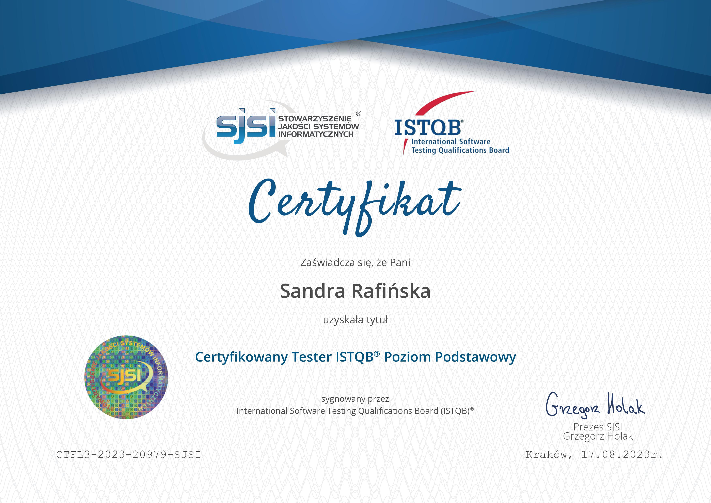

## NARZĘDZIA

* **Języki programowania:** Java (w trakcie nauki)
* **Bazy danych:** MySQL
* **Systemy kontroli wersji:** GIT
* **Metodologia zarządzania:** SCRUM
* **Narzędzia do zarządzania testowaniem:** Jira
* **Narzędzia wspomagające testowanie:** Konsola Chrome, podstawy Postmana, TestLink, Browserstack

## UMIEJĘTNOŚCI TECHNICZNE

* Testowanie oprogramowania 
* Tworzenie przypadków testowych
* Tworzenie planu testów
* Zgłaszanie błędów
* SQL

## KURSY

* Praktyczny kurs testowania oprogramowania - Udemy
* Podstawy manualnego testowania oprogramowania - Udemy
* Kurs SQL od podstaw | Mysql - Udemy

## BLOGI, STRONY TEMATYCZNE

* testerzy.pl
* remigiuszbednarczyk.pl

## MOJA DOKUMENTACJA TESTOWA

W moim portfolio znajdziesz różne elementy związane z dokumentacją testową, które pomagają mi w procesie testowania i utrzymaniu wysokiej jakości oprogramowania.

### PLAN TESTÓW

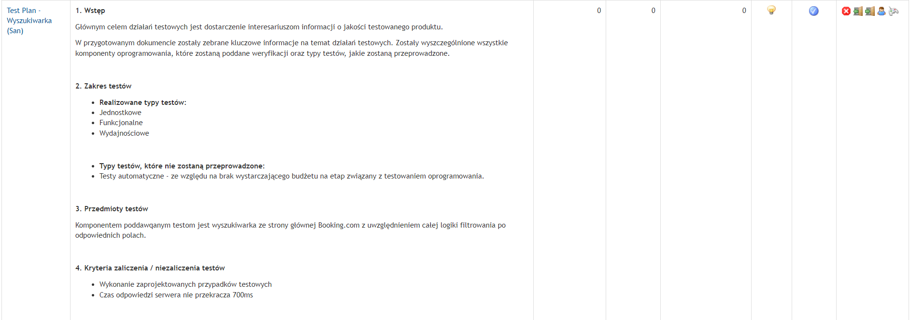
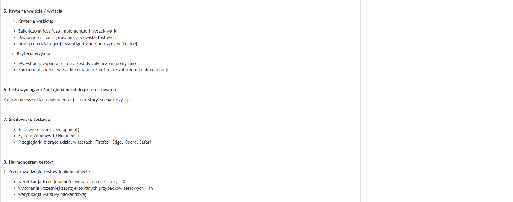
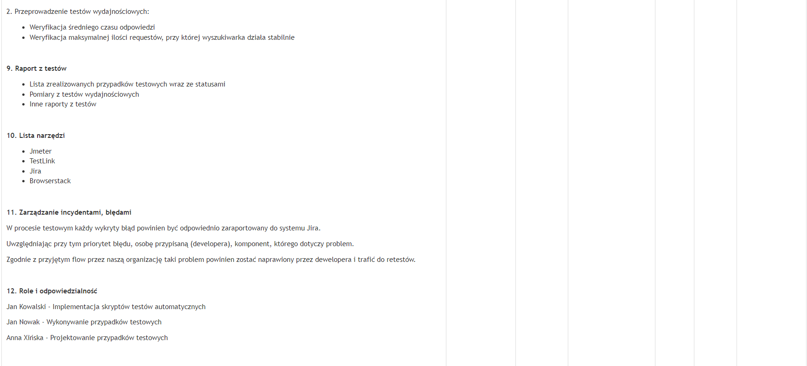

### ZGŁOSZENIE BŁĘDÓW

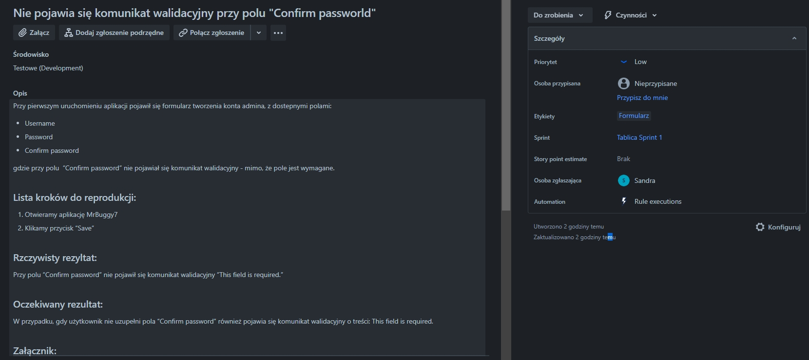
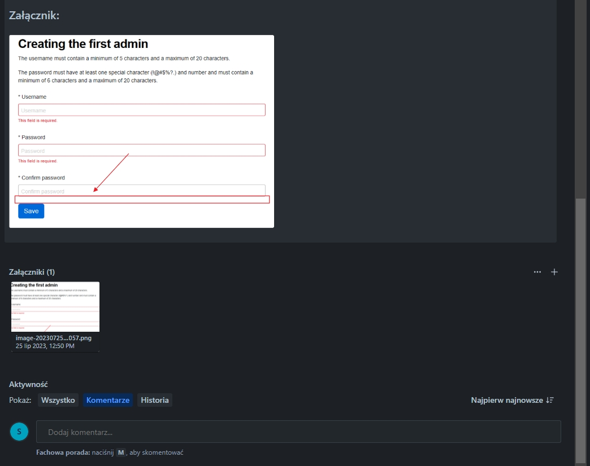
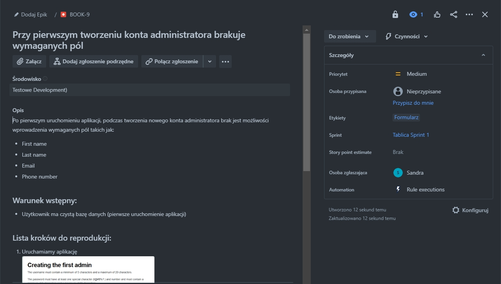
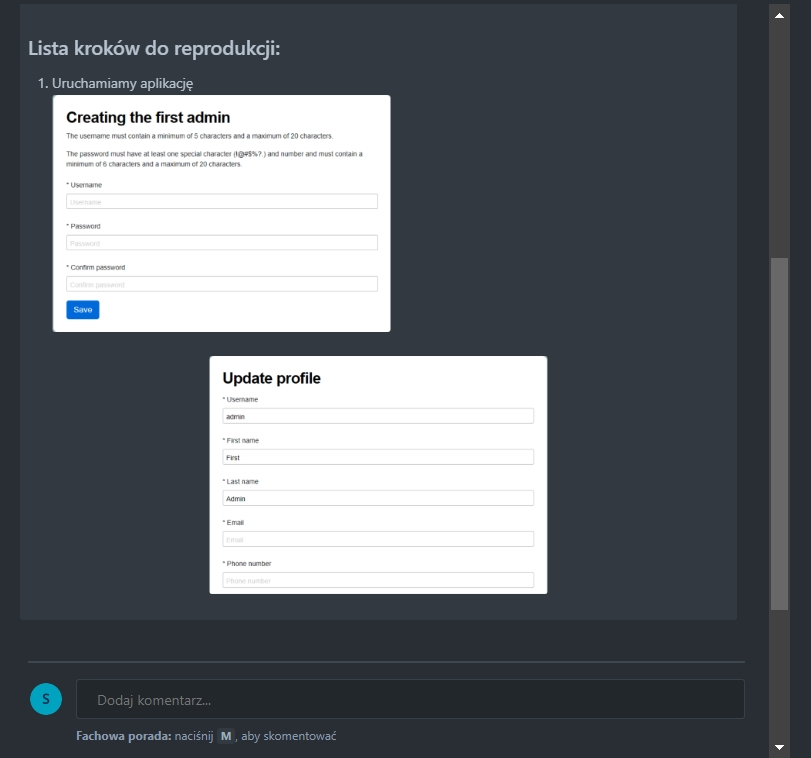
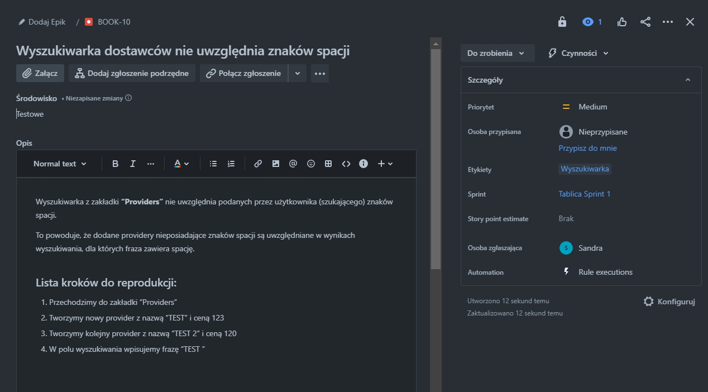
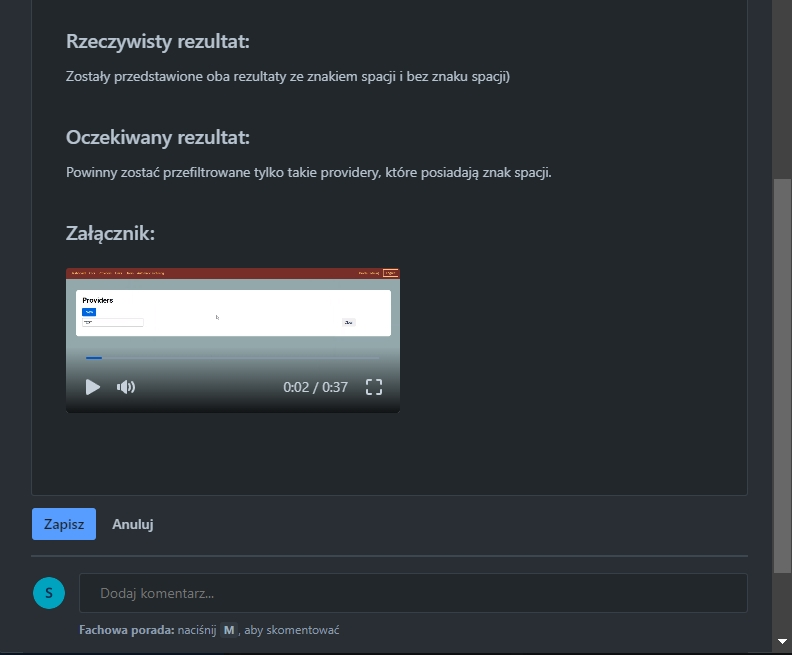
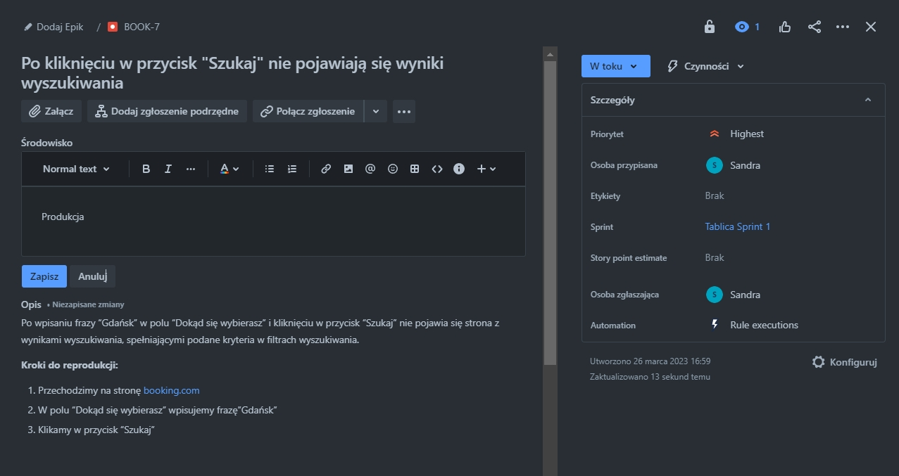
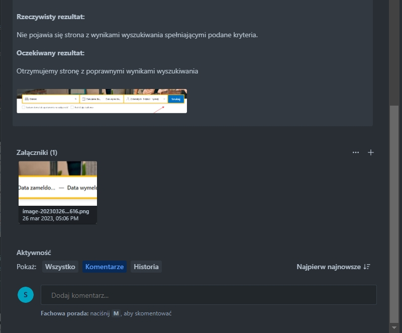

### PRZYPADKI TESTOWE

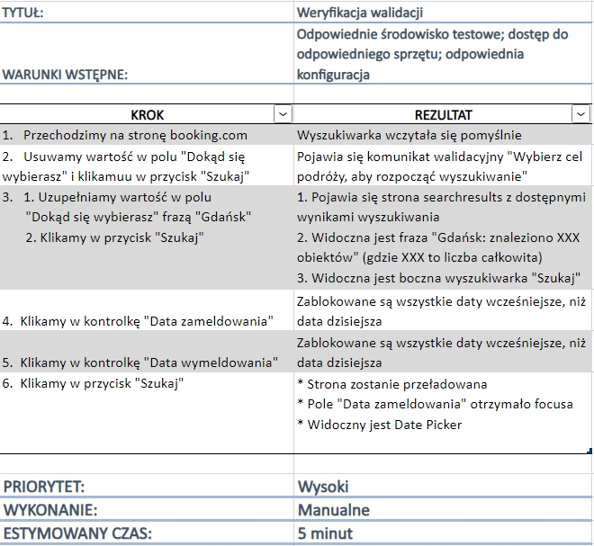
